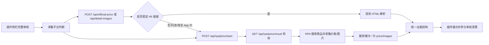

# RPA 接入触发方案

## 1. 现有审核链路

当前项目是浏览器插件版 MVP，核心闭环如下：

1. 采销打开新品审批详情页，点击浏览器插件。
2. `extension/background.js` 注入侧栏样式、字段解析脚本和内容脚本。
3. `extension/shared/analyzer.js` 从页面可见文本中识别商品名、SKU、品牌、规格、采购价、京东价、预估毛利率。
4. 侧栏里的“查官旗价”“采详情图”“完整审核”会请求本地采集服务。
5. `server/price-crawler.js` 暴露 HTML 采集接口和 RPA 异步接口：
   - `POST /api/official-price`：读取官旗商品页 HTML，调用 `price-extractor.js` 抽取到手价。
   - `POST /api/detail-images`：读取商品详情页 HTML，调用 `detail-image-extractor.js` 抽取主图、规格图、配方图、详情图。
   - `POST /api/rpa/price/start`：触发抖音/淘宝 RPA 价格和图片采集任务。
   - `GET /api/rpa/price/result?taskId=xxx`：查询 RPA 任务结果。
6. 前端拿到价格证据后调用 `analyzer.analyze()`，计算三场景贡利率、建议采购价、风险等级和审核意见。

这个链路里，RPA 最合适的接入层是 `server/price-crawler.js`。前端仍然只关心“获取价格证据”和“获取图片证据”，不直接感知淘宝、抖音或影刀账号。

## 2. PDF 中的 RPA 能力

附件里的价格爬取文档给出的是影刀开放平台调用链路：

1. 调用 token 接口获取 `accessToken`。
2. 用 `Authorization: Bearer <accessToken>` 调用任务启动接口。
3. 请求体包含 `robotUuid`、`accountName` 和 `params`。
4. 抖音示例参数包含：
   - `searchWord`：搜索词，例如商品名或关键词。
   - `source`：平台来源码。
5. RPA 返回结果中可归一出：
   - `price`：采集到的价格。
   - `skuName`：采集到的商品名。
   - `pics`：图片或截图地址。
   - `searchWord`：本次搜索词。

密钥和账号信息不能写入插件或仓库，应放在服务端环境变量或公司密钥管理系统中。

## 3. 推荐触发方式

保留现有前端动作不变，只在采集服务中增加平台路由。



建议规则：

- 如果传入 `officialUrl` 且页面可被服务端访问，优先走现有 HTML 解析。
- 如果 `platform` 为 `douyin`，或 URL 是抖音 App/短链/无稳定 H5，走 RPA。
- 如果 `platform` 为 `taobao` 且 H5 页面受登录、风控或动态渲染影响，走 RPA。
- 如果只有商品名、品牌、规格，没有链接，也走 RPA 搜索。

## 4. 已实现接口

### 4.1 触发 RPA

```http
POST /api/rpa/price/start
Content-Type: application/json
```

```json
{
  "productName": "西红柿",
  "brand": "",
  "spec": "",
  "platform": "douyin",
  "useRpa": true
}
```

返回：

```json
{
  "ok": true,
  "taskId": "xxxx",
  "status": "running",
  "platform": "抖音",
  "mock": false,
  "phase": "waiting_config",
  "phaseText": "等待真实影刀配置，任务保持异步等待",
  "taskMode": "waiting-config",
  "nextPollMs": 1200,
  "pollUrl": "/api/rpa/price/result?taskId=xxxx",
  "candidates": [],
  "images": []
}
```

### 4.2 查询 RPA 结果

```http
GET /api/rpa/price/result?taskId=xxxx
```

任务完成后返回：

```json
{
  "ok": true,
  "taskId": "xxxx",
  "status": "succeeded",
  "platform": "抖音",
  "mock": true,
  "phaseText": "真实结果未按时回传，已使用演示兜底识价入账",
  "candidates": [
    {
      "platform": "抖音",
      "shopName": "抖音官方旗舰店",
      "title": "普罗旺斯番茄 约500g",
      "finalPrice": 8,
      "priceType": "演示兜底识价",
      "confidence": 65,
      "evidence": "演示兜底截图/OCR price=8, skuName=普罗旺斯番茄 约500g"
    }
  ],
  "images": [
    {
      "url": "https://internal-storage.example/rpa/detail-001.png",
      "type": "detail",
      "sourceKey": "douyin",
      "platform": "抖音",
      "confidence": 70,
      "evidence": "演示兜底返回 pics 字段"
    }
  ]
}
```

前端会保留每个平台的图片证据。真实 RPA 回传时，建议每张图都带上：

```json
{
  "url": "https://internal-storage/rpa/douyin-001.png",
  "type": "screenshot",
  "sourceKey": "douyin",
  "platform": "抖音",
  "evidence": "抖音 App 商品详情页价格截图"
}
```

如果只返回 PDF 示例里的 `pics` 字符串，服务端会按当前任务平台自动补 `sourceKey`，前端仍会归档到“抖音 RPA”或“淘宝 RPA”证据包。

### 4.3 兼容旧接口

`POST /api/official-price` 和 `POST /api/detail-images` 仍保留。传入 `platform: "douyin"`、`platform: "taobao"`、`useRpa: true`，或传入 `rpa://`、抖音、淘宝链接时，会返回 `202` 和 RPA `taskId`，调用方再按 `pollUrl` 查询。

## 5. 请求字段

现有请求可兼容扩展以下字段：

```json
{
  "productName": "普罗旺斯番茄 约500g",
  "brand": "示例品牌",
  "spec": "约500g",
  "skuId": "100283434137",
  "platform": "douyin",
  "officialUrl": "",
  "source": 100
}
```

最终结果会被归一成现有结构，避免审核计算逻辑感知 RPA 细节：

```json
{
  "ok": true,
  "candidates": [
    {
      "platform": "抖音",
      "shopName": "品牌官方旗舰店",
      "title": "普罗旺斯番茄 约500g",
      "url": "",
      "finalPrice": 8,
      "listPrice": 8,
      "priceType": "RPA采集价",
      "couponDiscount": null,
      "confidence": 80,
      "evidence": "影刀RPA返回 price=8, skuName=普罗旺斯番茄 约500g",
      "capturedAt": "2026-07-05T00:00:00.000Z"
    }
  ],
  "errors": []
}
```

详情图接口可以复用同一个 RPA 结果：

```json
{
  "ok": true,
  "images": [
    {
      "url": "https://internal-storage/detail-001.png",
      "type": "detail",
      "confidence": 80,
      "evidence": "影刀RPA返回 pics 字段"
    }
  ],
  "capturedAt": "2026-07-05T00:00:00.000Z"
}
```

## 6. 影刀适配器设计

新增一个服务端适配器即可，不建议把调用逻辑放进插件：

```text
server/rpa-client.js
  getYingdaoToken()
  startYingdaoJob({ platform, searchWord, source })
  completeRpaTask(raw)
  normalizeYingdaoResult(raw)
```

建议环境变量：

```text
YINGDAO_ACCESS_KEY_ID=...
YINGDAO_ACCESS_KEY_SECRET=...
YINGDAO_TOKEN_URL=https://api.yingdao.com/oapi/token/v2/token/create
YINGDAO_DISPATCH_URL=https://api.yingdao.com/oapi/dispatch/v2/job/start
YINGDAO_RESULT_URL=...
YINGDAO_RESULT_METHOD=GET
YINGDAO_PRICE_ROBOT_UUID=...
YINGDAO_ACCOUNT_NAME=...
YINGDAO_DOUYIN_SOURCE=100
YINGDAO_TAOBAO_SOURCE=...
RPA_ALLOW_MOCK_FALLBACK=true
RPA_FALLBACK_DELAY_MS=15000
RPA_MOCK_DELAY_MS=15000
RPA_NEXT_POLL_MS=1200
```

注意：PDF 中抖音任务请求示例的 `source` 是 `100`，返回参数示例中又出现 `source: 6`。正式接入前需要和 RPA 机器人维护方确认来源码含义，避免把平台码和数据源码混用。

## 7. 当前测试方式

启动服务后，在 demo 页面中：

1. 打开 `http://127.0.0.1:8123/demo/approval-page.html`。
2. 打开插件侧栏。
3. 点击“全平台取证审核”或“全平台取证并生成意见”。
4. 不填官旗链接也可以，网页官旗会走 demo 官旗页，抖音/淘宝会触发手机 RPA。
5. 填全网低价、BOM 成本，或直接用测试值：`14.2`、`19`、`21`。
6. 侧栏会先显示任务创建、手机执行、截图识价；真实结果超时后才显示“兜底入账”。

接口测试：

```bash
curl -s -X POST http://127.0.0.1:8787/api/rpa/price/start \
  -H 'Content-Type: application/json' \
  -d '{"productName":"西红柿","platform":"douyin","useRpa":true}'
```

启动后立即查询应保持 `running` 且没有价格候选。等待真实 RPA 回传或兜底窗口到达后，再使用返回的 `taskId`：

```bash
curl -s 'http://127.0.0.1:8787/api/rpa/price/result?taskId=xxxx'
```

## 8. 同步与异步策略

当前插件采用“真实优先 + 前端轮询”的异步体验：

1. 插件点击“完整审核”。
2. 插件调用 `/api/rpa/price/start`。
3. 服务端返回 `taskId` 和 `pollUrl`。
4. 插件轮询 `/api/rpa/price/result?taskId=xxx`。
5. 真实 RPA 回传成功后直接填充官旗价、截图和详情图证据。
6. 真实 RPA 未配置、结果接口未配置或查询不到结果时，服务端继续保持 `running`，超过兜底窗口后才显式回退“演示兜底识价”。

生产建议保持同样异步模型：

1. `/api/rpa/price/start` 返回 `taskId` 和 `status: running`。
2. 插件展示“RPA 正在采集抖音/淘宝价格”。
3. 插件轮询 `/api/rpa/price/result?taskId=xxx`；如果 RPA 平台支持回推，调用 `/api/rpa/price/callback` 入账。
4. 成功后把价格、图片、截图地址写入证据包。
5. 失败时允许人工录入价格，并保留失败原因。

## 9. 风控和权限边界

- 插件不保存影刀账号、平台账号、accessKeySecret。
- 采集服务只部署在内网，所有 RPA 调用走服务端。
- RPA 结果必须带采集时间、平台、搜索词、原始商品名、图片或截图证据。
- 高风险审核结论只辅助采销，不自动点击通过或驳回。
- 对同一 SKU、同一平台做缓存，避免重复触发 RPA 和平台风控。
- 采集失败时回退为人工补录，不阻断审核流程。

## 10. 最小落地路径

第一步：在 `price-crawler.js` 中按 `platform` 或 URL 判断是否走 RPA。

第二步：增加 `rpa-client.js`，用环境变量读取影刀配置，完成 token 和 job start。

第三步：把 RPA 返回的 `price`、`skuName`、`pics` 归一成现有 `candidates` 和 `images`。

第四步：在侧栏状态里区分“HTML 解析采集”和“RPA 采集中”，但不改变审核计算逻辑。

第五步：补充测试，用 mock RPA 响应验证抖音/淘宝触发分支。
