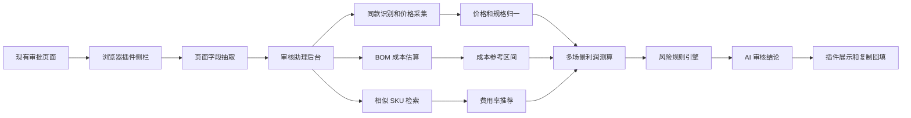
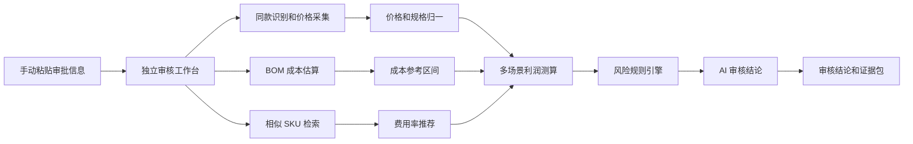

# 新品审核智能助理功能设计

## 1. 项目定位

面向采销和 Boss 新品审核场景，建设一个“新品审核智能助理”。它不是单纯的毛利计算器，而是把当前人工 1 小时左右的审核流程，压缩为自动取数、自动找价、自动估算、自动预警、人工确认的半自动审核链路。

核心目标：

- 提升效率：减少人工去竞对平台搜索、截图、查历史 SKU、填 Excel 的时间。
- 提升准确度：统一成交价、费用率、促销场景、目标贡利率的计算口径。
- 提升可解释性：每个结论都带证据来源、置信度和风险原因，方便采销谈判和 Boss 审批。
- 提前压实成本：新品阶段就识别采购价虚高、促销亏损、费率低估等问题。

## 2. 当前人工流程拆解

| 环节 | 当前做法 | 主要问题 | 可智能化方向 |
|---|---|---|---|
| 审批提醒 | 采销工作台收到新品审批 | 品牌自填采购价、京东价，预估毛利率常失真 | 自动读取审批单基础信息，识别异常毛利 |
| 官旗成交价 | 用商品名、图片、规格到天猫、抖音等官旗搜索真实到手价 | 搜索耗时，容易漏掉同款或规格差异 | 多平台同款识别、到手价抽取、规格归一 |
| 全网低价 | 去闲鱼、拼多多等找低价作为谈判筹码 | 证据零散，人工截图整理 | 自动检索低价区间，标注渠道可信度 |
| BOM 成本 | 把配方、成分、包装信息发给 GPT 估成本 | 准确性不稳定，缺少置信区间 | 按品类建立成本估算模板和置信度 |
| 费用率推算 | 找相似 SKU，在黄金眼看 YTD 费率 | 找相似 SKU 依赖经验，费率口径不统一 | 基于品类、规格、价格带、品牌等级自动推荐参考 SKU |
| 促销测算 | Excel 中录入促销价、礼金、PLUS、券、费率，测日销、大促、最低凑单毛利 | 手工填表慢，容易漏算自投广告和极限促销场景 | 一键生成多场景利润测算和风险提示 |

## 3. 产品形态

建议优先做成浏览器插件形态，在采销现有审批页面上打开 AI 审核侧栏。这样不需要改造审批系统本身，也不依赖审批系统所属团队排期。

页面名称：新品审核智能助理

入口：

- 采销打开现有新品审批页面后，点击浏览器插件图标。
- 插件在页面右侧打开“AI 审核侧栏”。
- 侧栏自动读取当前审批页可见字段，也支持手动补充字段。
- 生成结论后，一键复制审核意见、谈判话术和证据摘要，再粘贴回原审批系统。

输出结果：

- 审核建议：通过、需降采、需补充信息、建议驳回。
- 核心原因：采购价高于官旗到手价、最低促销贡利为负、费用率低估、BOM 成本偏离等。
- 建议采购价：按目标贡利率和费用率自动反推。
- 谈判证据包：竞对价格、全网低价、BOM 估算、相似 SKU 费率、促销测算表。

### 3.1 浏览器插件切入方案

插件不改变原审批系统代码，只在采销浏览器侧提供一个外挂能力。

工作方式：

1. 采销进入现有审批详情页。
2. 插件识别当前页面 URL、审批单 ID、商品名称、商品图片、采购价、京东价、规格等字段。
3. 插件把识别到的信息发送到新品审核智能助理后台。
4. 后台完成竞对价补充、费用率推荐、BOM 成本参考、促销利润测算。
5. 插件侧栏展示 AI 审核结论、风险原因、建议采购价和证据包。
6. 采销确认后，把审核意见复制回原审批页面。

插件能力边界：

- 不直接修改审批系统页面数据。
- 不绕过现有审批权限。
- 不自动点击通过或驳回。
- 只读取当前用户有权限看到的页面信息。
- 关键结论必须由采销人工确认。

适合大赛表达：

> 在不改造现有审批系统的情况下，通过浏览器插件把 AI 审核能力挂载到审批页面，实现“看单即分析、结论可复制、证据可追溯”。

### 3.2 插件实现要点

插件可采用 Chrome 或 Edge 企业内部分发方式。

关键组成：

- 内容脚本：只在审批系统域名下运行，负责读取页面文本、表格字段、商品图片和审批单 ID。
- 侧栏页面：展示 AI 分析进度、结论卡、证据包和复制按钮。
- 后台服务：接收商品信息，完成价格证据补充、费用率推荐、促销测算和审核意见生成。
- 配置中心：维护不同审批页面的字段选择器，页面结构变化时不用重新发版。

权限控制：

- 插件只申请审批系统相关域名权限。
- 默认只读页面，不写入、不点击、不自动提交。
- 所有敏感数据传输到内部审核助理后台，不发送到个人外部服务。
- 生成结论后由采销人工确认，再复制回审批页面。

## 4. 核心功能模块

### 4.1 审批单智能读取

自动从新品审批单读取：

- 商品名称、商品编码、品牌、类目、规格、净含量、主图、详情图。
- 品牌提报采购价、京东价、预计毛利率。
- 是否裸采、是否自投广告、促销资源、供应商信息。

系统先做基础异常检查：

- 京东价低于采购价。
- 预估毛利率异常偏高或偏低。
- 同类目价格带明显偏离。
- 规格缺失、图片不清晰、配方信息不足。

### 4.2 多平台同款识别和真实成交价

自动基于商品名、图片、规格识别同款商品。

数据来源优先级：

1. 官方旗舰店或品牌自营店，例如天猫官旗、抖音官旗。
2. 京东站内同品牌或历史同款。
3. 经销商渠道、C 店、拼多多、闲鱼等低价来源。

识别逻辑：

- 文本匹配：品牌、品名、口味、规格、净含量、包装数量。
- 图片匹配：主图相似度、包装元素、SKU 颜色和图案。
- 规格归一：把 500g、1kg、2 包装等统一折算为单件价或每 kg 单价。
- 到手价解析：识别券后价、满减价、会员价、直播价、凑单价。

输出字段：

- 平台、店铺、商品链接、标价、到手价、规格、单价、采集时间。
- 是否官方渠道。
- 同款置信度。
- 价格可信度。

### 4.3 采购价合理性判断

核心判断：

- 品牌提报采购价是否低于官旗真实到手价。
- 采购价和竞对成交价之间是否留有合理利润空间。
- 采购价是否高于全网低价过多。
- 是否存在新品一上线即无毛利或负毛利风险。

建议规则：

- 如果采购价 >= 官旗到手价，强风险，建议驳回或要求降采。
- 如果采购价接近官旗到手价，但费用率和目标贡利后为负，建议降采。
- 如果采购价低于官旗价但高于 BOM 估算和同类 SKU 采购价区间过多，提示谈判空间。

### 4.4 BOM 成本参考

对有配方、成分、包装规格的商品，生成成本参考。

输入：

- 商品类目，例如宠物食品、日化、食品、家清。
- 配方图、成分表、净含量、包装形式。
- 原料等级、工艺复杂度、包装材料。

输出：

- 预估出厂成本区间。
- 参考采购价区间。
- 成本构成说明。
- 置信度：高、中、低。
- 需要人工补充的信息。

注意：BOM 成本只能作为谈判参考，不能作为唯一审批依据。系统必须明确标注“估算值”。

### 4.5 相似 SKU 费用率推荐

从历史 SKU 中自动找可比样本。

相似条件：

- 同类目、同品牌或相近品牌。
- 同规格或可折算规格。
- 相似价格带。
- 相似销售模式，例如裸采、代销、自投广告。
- 有 YTD 费用率和贡利数据。

输出：

- 推荐参考 SKU 列表。
- 可控费率、不可控费率、自投广告费率。
- 平均费用率、P25/P50/P75 区间。
- 推荐采用费率。
- 采用原因和样本数量。

费用率规则：

- 默认费用率 = 可控费率 + 不可控费率 + 自投广告费率。
- 样本不足时，使用类目默认费率，并降低置信度。
- 裸采品牌必须把自投广告计入费用率。

### 4.6 多场景促销利润测算

系统自动生成三个核心场景：

| 场景 | 用途 | 价格口径 |
|---|---|---|
| 日销场景 | 判断常规销售是否健康 | 日常到手价、常规券、PLUS 折扣 |
| 大促场景 | 判断 618、11.11 是否可参与 | 预估大促价、礼金、促销资源、广告费 |
| 最低凑单场景 | 判断极限促销是否亏损 | 最低凑单价、最大优惠叠加 |

关键公式：

```text
建议采购价 = 预估件单价 × (1 - 平均费用率 - 目标贡利率)
```

默认目标贡利率：12%。

风险判断：

- 最低贡利 < 0：强风险。
- 最低贡利 < 目标贡利：中高风险。
- 建议采购价 < 品牌提报采购价：需要降采。
- 日销可盈利但大促亏损：提示限制促销资源或重新谈判。

### 4.7 AI 审核结论生成

系统基于结构化数据生成审核建议。

示例：

```text
审核建议：建议驳回或要求采购价降至 22.40 元以内。

原因：
1. 官旗同款 1kg 商品到手价为 27.99 元，品牌提报采购价为 30.00 元，采购价高于终端成交价。
2. 按相似 SKU 平均费用率 14.5%、目标贡利率 12% 反推，建议采购价为 20.57 元。
3. 最低凑单场景下贡利为 -4.3%，存在促销亏损风险。
4. BOM 估算出厂成本区间为 19.00-21.00 元，当前采购价偏高。
```

## 5. 关键页面设计

### 5.1 浏览器插件入口

入口形态：

- 浏览器工具栏插件图标。
- 审批页面右下角悬浮按钮。
- 页面右侧抽屉式侧栏。

插件打开后先展示：

- 当前识别到的商品名称、规格、采购价、京东价。
- 字段识别完整度。
- “开始智能分析”按钮。
- “手动补充信息”入口。

异常处理：

- 如果页面字段识别失败，支持手动粘贴审批单信息。
- 如果当前页面不是新品审批页，提示进入审批详情页后再使用。
- 如果缺少关键字段，提示采销补充后再测算。

### 5.2 AI 审核侧栏

侧栏分为五块：

1. 商品基础信息：主图、名称、规格、品牌提报价。
2. AI 总结卡：审核建议、风险等级、建议采购价、预计毛利。
3. 价格证据：官旗价、全网低价、历史价、同款置信度。
4. 成本和费率：BOM 估算、相似 SKU 费率、费用率采用口径。
5. 促销测算：日销、大促、最低凑单三场景利润。

采销可操作：

- 复制通过意见。
- 复制驳回意见。
- 复制降采谈判话术。
- 调整目标贡利率或费用率后重新测算。
- 标记竞对匹配错误。
- 补充促销资源或自投广告比例。
- 打开完整证据包。

### 5.3 证据包

证据包用于和品牌、Boss 沟通。

包含：

- 商品基础信息。
- 竞对同款价格截图或链接。
- 全网低价截图或链接。
- 相似 SKU 费用率样本。
- BOM 成本估算说明。
- 三场景毛利测算。
- AI 结论和人工确认记录。

## 6. 系统架构建议



插件和后台分工：

- 浏览器插件：页面字段读取、侧栏展示、人工补充、复制结果。
- 审核助理后台：价格证据、历史 SKU 检索、利润测算、规则判断、AI 文案生成。
- 数据服务：竞对价格、历史经营数据、类目费率、成本知识库。

备用架构：



### 数据层

- 审批单数据：采购价、京东价、商品信息、供应商。
- 竞对价格数据：官方渠道、经销商渠道、低价渠道。
- 历史经营数据：同类 SKU 销售、费用率、贡利率、促销表现。
- 成本知识库：类目成本模型、原料价格、包装成本、工艺系数。
- 审核结果数据：AI 建议、人工采纳、驳回原因、品牌最终降采结果。

### AI 能力层

- 商品同款识别：文本 + 图片 + 规格。
- 到手价解析：从复杂促销文案中抽取实际成交价。
- 成本估算：基于类目模板和配方信息估算区间。
- 相似 SKU 推荐：向量检索 + 规则过滤。
- 审核意见生成：把测算结果转成可读、可复制的审核意见。

### 规则层

规则层要独立于大模型，保证关键财务判断可控。

- 毛利和贡利公式。
- 目标贡利率。
- 费用率采用逻辑。
- 高风险阈值。
- 强制驳回条件。
- 人工复核条件。

## 7. MVP 版本建议

第一阶段不要一次做全，建议聚焦“审批提效 + 利润准确测算”。

MVP 功能：

1. 浏览器插件在审批页打开侧栏。
2. 审批单可见字段自动读取。
3. 手动或半自动录入竞对官旗价、全网低价。
4. 自动推荐相似 SKU 费用率。
5. 自动计算日销、大促、最低凑单三场景。
6. 自动反推建议采购价。
7. 自动生成审核意见和谈判话术。
8. 一键复制结论回原审批系统。
9. 保存证据包。

首版可不做：

- 自动回填审批表单。
- 自动点击通过或驳回。
- 审批列表批量改造。
- 原审批系统接口改造。

暂缓功能：

- 全平台自动爬价。
- 完全自动图片同款识别。
- 高精度 BOM 成本模型。
- 自动审批。

这样更容易在大赛中落地展示，也能规避跨团队系统改造、数据权限和平台采集风险。

插件版 Demo 最小闭环：

1. 打开现有审批详情页。
2. 点击浏览器插件。
3. 侧栏识别当前商品和价格。
4. 点击“智能分析”。
5. 侧栏返回风险等级、建议采购价、三场景毛利、审核意见。
6. 点击“复制审核意见”，粘贴回审批页面。

保底方案：

如果插件读取页面字段受限制，可以先让采销复制审批页文本或截图到侧栏，AI 从粘贴内容中抽取商品信息。这样 Demo 仍然成立，后续再升级为自动读取。

## 8. 大赛展示故事线

建议用一个具体 SKU 做 Demo。

展示顺序：

1. 痛点：人工审核一个 SKU 约 1 小时，且品牌自填毛利不可信。
2. 切入：不改审批系统，只在审批页打开浏览器插件侧栏。
3. 输入：插件自动识别采购价、京东价、商品图、规格。
4. AI 找证据：识别官旗同款价 27.99 元、全网低价 14.2 元、BOM 成本 19-21 元。
5. AI 算账：相似 SKU 费用率 14.5%，目标贡利率 12%，反推建议采购价。
6. AI 给结论：当前采购价 30 元不合理，建议降至某价格以内或驳回。
7. 回填：采销一键复制审核意见，粘贴回原审批系统。
8. 价值：审核时间从 60 分钟降到 5-10 分钟，风险识别更统一，采购谈判有证据。

## 9. 衡量指标

效率指标：

- 单 SKU 审核耗时：60 分钟降至 5-10 分钟。
- 批量审核吞吐量提升。
- 人工录入字段数量减少。

准确性指标：

- 竞对同款识别准确率。
- 到手价抽取准确率。
- 费用率推荐误差。
- 毛利测算误差。

业务指标：

- 新品降采成功金额。
- 驳回高风险新品数量。
- 新品上线后毛利达标率。
- 大促亏损风险减少。

采纳指标：

- AI 建议采纳率。
- 人工改写审核意见比例。
- Boss 审批退回率。

## 10. 风险和控制

| 风险 | 控制方式 |
|---|---|
| 竞对价格采集不稳定 | 保留人工录入和截图上传入口 |
| 同款识别误判 | 显示置信度，要求高风险结论人工确认 |
| BOM 成本估算不准 | 只作为参考，不参与强制结论 |
| 历史 SKU 样本不足 | 回退到类目默认费率，并标注低置信度 |
| 大模型生成结论幻觉 | 所有数值来自结构化计算，AI 只负责解释和组织语言 |
| 自动审批风险 | 初期只做辅助决策，不做无人审批 |
| 插件读取审批页字段失败 | 支持手动粘贴审批信息或截图识别 |
| 审批系统页面结构变化 | 插件字段识别规则配置化，保留人工补录 |
| 跨团队接入推进慢 | 插件先行，后续再升级为正式系统集成 |

## 11. 推荐参赛命名

可选名称：

- 新品审核智能助理
- AI 新品利润雷达
- 采销新品成本卫士
- 新品降采 Copilot
- 真自营新品审核 Agent

推荐使用：“新品审核智能助理”。它比“计算器”更能体现 AI 产品孵化价值，也能覆盖采销和 Boss 两类审核角色。
